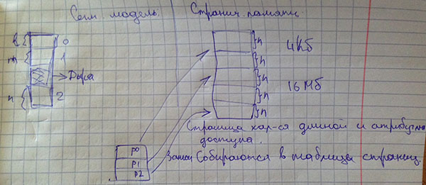

# Лекция 2.3

## Режимы работы процессора архитектуры x86

Есть два режима работы:

- реальный;
- защищенный.

Начиная с процессоров 80286 вводится поддержка многозадачности и защищенной архитекрутры на аппаратном уровне.

В целях совместимости с младшими (8086/8088) данный процессор поддерживал два режима работы:

- реальный режим (режим реального адреса);
- защищенный режим (режим защещенной виртуальной адресации).

В реальном режиме процессор вел себя ровно как 8086. В режиме защищенном процессор использовал все возможности.

В момент включения компьютера процессор работает в режиме 8086, после загрузки ядра включается защищенный режим.

**В режиме эмуляции 8086:**

- загружаются программы BIOS;
- инициализация компонентов необходимых для защищенного режима.

*OS DOS* (одназадачная) - не переводит процессор в защищенный режим, т.к. она однозадачная. Это могут делать программы если им это нужно.

### Характерны особенности реального режима:

1. Возможна адресация до 1 Мб.

	**Формирование адреса**: *<номер сегмента>* * 16 + *<16 бит смещения>*
	
	**Пр.** `0400h:0001h = 400h * 16 + 0001`
	
	8086 - 20-битная адресная шина: `2^20 бит= 1 Мб`
	
	80286 - 24-битная шина: `2^24 бит = 16 Мб`
	
	В целях совместимости введен логический элемент Gate A20 - перекрывает 4 	последних бита.
	
	
2. Сегментная модель

	Размер сегмента не превышает 64кб. В сегментных регистрах DS, CS находится адрес сегмента.

3. Нет поддержки многозадачности - нет необходимости контролировать взаимное влияние программ.

4. Любая программа может обратиться к любому участку памяти.

### Характерны особенности защищенного режима:

Основная цель - поддержка многозадачности.

Задачи:

 - Исключить взаимное влияние программ;
 - Обеспечить корректное взаимодействие между программами.

Особенности:
 
1. Меняется принцип работы с памятью
2. Меняются функции и список программно-аппартных компонентовучавствующих в организации доступа к памяти.
3. Остается сегментная модель. Каждый сегмент памяти снобжаетс доп. характеристиками.
	1. Размер сегмента
	2. Набор атрибутов, достаточный для того, чтобы часть контроля над сегментом отдать аппартной части.
	
##### Принципы сегоментной организации памяти


***рис. Принципы работы сегментов***

Сегмент соответсвует процессу. Процесс видит не все адресное пространство, а только область сегмента.

Раздачей сегментов занимается ядро ОС - реализует изоляцию процессов.

Дескриптор сегмента - этой 8-байтная структура, которая содержит:

- физический адрес сегмента;
- длина сегмента;
- уровень превилегий сегмента относительно других сегментов;
- тип сегмента (опеределяет назначение *чтение/запись/исполнение*).

С помощию превилегий и типов осуществляется контроль доступа к сегменту, и произвольная программа уже не может иметь доступа к произвольному сегменту.

Контроль обращения к памяти (проверка превилегий) происходит на этапе формирования логического адреса. Если все хорошо адрес формируется след. образом:

```
(Селектор сегмента - 16 бит) + (32-битное смещение в пределах сегмента)
```

Виртуально можно адресовать до 4-х мегабайт (в 32-разрядных системах).

**Формат селектора (16 бит):**

- **0-1** - описание превелгий текущего сегмента
- **2** - признак откуда брать таблицу (*глобальная - GDT/локальная - LDT*)
- **3-15** - номер дескриптора в таблице.

Дексрипторы сегментов группируются по 3-м разным таблицам в зависиости от назанчения сегмента. Арес таблицы может быть произвольным и помещается в спец. сегментный регистр.

Главное отличие сегментной адресации защищенного и реального режима это использование таблиц для адресации.

**Защита доступа может осуществляться в двух точках:**

1. Попытка загрузки селектора в сегментный регистр.
2. Обращение к странице памяти.

Существуют четыре уровня превилегий (кольца защиты). Нумерация происходит от 0 до 3. В порядке убывания превилегий.

Уровень | Что находится 
--- | ---
0 | Ядро системы
1 | Уровень драйверов
2 | Уровень драйверов
3 | Уровень приложений


На что накладывают ограничения *кольца защиты*:

- На использование памяти.
- На порты ввода-вывода.
- На использование некоторых инструкций.

При попытки загрузить декстриптор в сегментный регистр происходит следующая проверка:

1. Смотрится текущий сегмент кода и проверяется его текущий уровень превилегий.
2. Смотрится по таблице селекторов какие запрашиваемые ресурсы

	
	```
		[_________| CPL ] 			# текущий
		
		+-- [ index | TI | RPL ]	# запращиваемый
		|
		+-> [ __________ | DPL ]   # уровень защиты выбранного сегмента
		
		if max(CPL, RPL) <= DPL
			# разрешить доступ
		else 
			# отказать в доступе
	```


***Рис. Различие сегментной и страничной адресации.***

При обращении к странице памяти возможности контроля доступа обеспечивают 2 атрибута:

1. Флаг *чтение/запись*
2. Флаг *супервизор*. 

	```
	1 - доступ только из 0-го круга
	0 - из любого круга.
	```


