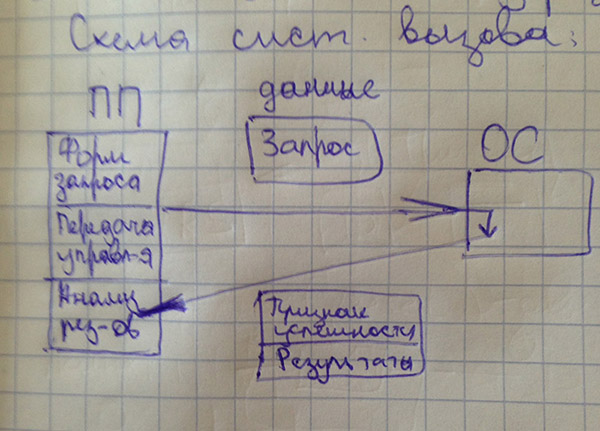

# Лекция 2.5

## Взаимодействие прикладной программы с операционной системой

ОС предастовляет набор услуг, которыми прикладная программа может пользоваться.

**Пр.** Ввод/вывод, работа с файловой системой

**Системный вызов** — обращение программы к ОС за услугами.

Системный вызов состоит из следующих действий:

1. подготовка данных формирующих запрос
2. передача управления операционной системе
3. анализ результатов вызова после выполнения услуги ОС



*Рис. Схема вызова (у Игоря)*

Порядок системных вызовов в различных ОС

- Используются стандарты системных вызовов (системные интерфейсы)
- На данный момент используются два варианта использования системных интерфейсов

	1. Программные прерывания  
	2. API-функции


Особенности каждого варианта

### Программные прерывания

Программные прерывания - вариант интерфейса системных вызовов.

Используется в системе DOS.

Основные характеристики:

1. Параметры формируются и передаются через регистры. Для сложных структур испольуются указатели, которые так же помещаются в регистры
	- Чаще всего используемые регистры для передачи: **EAX**, **EBX**, **ES**
2. Передача управления к ОС осуществляется командой процессора `int`, которая входит в  систему команд большенства процессоров.
3. Результаты передаются так же через регистры. 

	- Признак успешности выполнения процедуры это флаг переноса возведенный в 1.
	- Чаще всего используемые регистры для результатов: **AX**, **BX**	- При CF = 0 , код ошибким в AX
	
В процессорах защищенной архитектуры в момент передачи управления ОС происходит конфликт.

Команда `int _` - вектор прерывания.

### Вызов API-функции

Сейчас является стандартом.

**API** - Application prorgamming interface

Является частью стандартов OSE (Open System Environment) и POSIX.

Впервые реализованно в Linux.

Особенности API-функции:

1. Параметры передаются в аргументах функции 
	- Запрос: `<имя функции> <аргументы>`
	
2. Передача управления ОС осуществляется командой `call`. Аргументы помещаются в стек по соглашению о вызовах
	- Вход: `call`
	- Выход обратно: `ret`
3. Результаты чаще всего передаются через регистры или через память.
	- в AX — код возврата
	- AX <= 0 - ошибка
	- при положительном AX результаты возвращаются через регистры общего назначения.
	
	
Сложность — соглашение о вызовах.

- следить за порядком передачи аргументов через стек
- порядок очистки стека
- порядок считывания результата

Задача: Убрать различия между системными вызовами и вызовами обычных модулей.


### Особенность организации Windows-приложений

- 16-разрядное DOS приложение (нет ограничений на организуацию преложения)
 	- используются 16-разрядные регистры и смещения
 	- прерывания
- Консольное Windows-приложение 
 	- используются 32-разрядные регистры и смещения
 	- API-функции
- Оконное Windows-приложение
	- должны иметь определенную структуру
	- окно - отдельный объект (под управление ОС)


*(Рис. Схема оконного приложениярисунок у игоря)*

## Операции с плавающей точкой

**FPU** (Floating Point Unit) - сопроцессор до 486, далее входит в состав процессора.

FPU обладает своим набором регистров и своим набором команд.

В FPU могут храниться 3 типа вещественных чисел

```
# Схема числа с плавающей запятой
 N = m * b^p 
 m - мантиса
 p - порядок
 b - основание
```

Название типа | Кол-во разрядов (биты) | Мантиса (биты) | Степень порядка | Диапазон чисел
--- | :---: | :---: | --- | ---
Single Precision (одинарная точность) | 32 | 23 | 127 (8бит)| 2^(-126) — 2^(127)
Double Precision (удвоенная точность) | 64 | 52 | 1023 (11бит)| 2^(-1022) — 2^(1023)
Double Extended (удвоенная расширенная) | 80 | 64 | 16384 (15бит)| 2^(-16383) — 2^(16384)

**Пр.** 123.375 = 1111011.011

```
Нормализация числа:

1111011.011 = 2^6 * 1.111011011
```
	
знак |1| порядок + смещение |11| мантиса | 32
|:---:| ---| --- | ---
0 || 10000101 (127 + 6) || 111011011|

### Регистры FPU

*(картинка у Игоря)*


**Способы округления**


Регистры управления CR-битами

RC: 10-11 - округления
PC: 8-8 - выбор точности

RC | Способ
--- | ---
00 | к ближ. целому
01 | к  +infinity
10 | к  -infinity
11 | к нулю

PC | Точность
--- | ---
00 | Single
01 | Draft (зарезервировано)
10 | Double
11 | Double extended